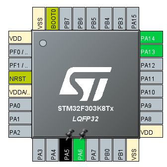
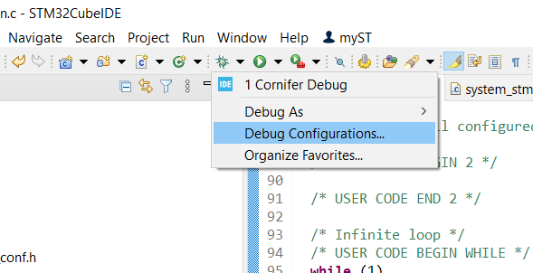

# Obiettivo
Configurare un STM32F303 con il modulo MCP23017 mediante il protocollo I2C

# 🚶🏻‍♂️Primi passi
- Navigando in rete ho trovato questa [libreria](https://github.com/ruda/mcp23017) che consente di far comunicare il microcontrollore con il modulo mediante I2C.
- Ho installato l'IDE ufficiale di ST microelectronics
- Ho visto vari video tutorial da questo ottimo [canale](https://www.youtube.com/c/ucik8jm7gbihceun-ag_8kag) 
- Sto usando gli appunti del Professore Giovanni Artale di Unipa

# 📖Teoria

### I2C 
Il protocollo I2C (Inter-Integrated Circuit) è un protocollo seriale a due fili utilizzato per la comunicazione tra dispositivi digitali su una scheda elettronica. Consente la trasmissione bidirezionale dei dati tra un master e uno o più slave, utilizzando una linea di dati (SDA) e una linea di clock (SCL). I dispositivi comunicano tramite "frame" di dati che includono un indirizzo di destinazione e comandi o dati. I vantaggi includono semplicità, efficienza nell'uso dei pin di I/O e la capacità di collegare più dispositivi allo stesso bus. È ampiamente utilizzato in sensori, memorie e dispositivi di controllo nell'elettronica embedded.

# 🧰Strumentazione

### Modulo MCP23017
La famiglia di dispositivi MCP23X17 fornisce un'espansione I/O parallela generale a 16 bit per applicazioni bus I2C o SPI. Le due varianti dei dispositivi differiscono solo per l'interfaccia seriale:
- MCP23017: Interfaccia I2C
- MCP23S17: Interfaccia SPI

Il MCP23X17 è composto da più registri di configurazione a 8 bit per l'input, l'output e la selezione di polarità. Il master del sistema può abilitare gli I/O come input o output scrivendo i bit di configurazione IODIRA/B. I dati per ciascun input o output sono mantenuti nel relativo registro di input o output. La polarità del registro di porta di input può essere invertita con il registro di inversione di polarità. Tutti i registri possono essere letti dal master del sistema.

La porta I/O a 16 bit funzionalmente consiste di due porte a 8 bit (PORTA e PORTB). Il MCP23X17 può essere configurato per operare in modalità a 8 o 16 bit tramite IOCON.BANK.

Ci sono due pin di interruzione, INTA e INTB, che possono essere associati alle rispettive porte o logica OR per attivare entrambi i pin se una delle porte causa un'interruzione. L'uscita di interruzione può essere configurata per attivarsi in due condizioni (mutuamente esclusive):
1. Quando lo stato di un qualsiasi input è diverso dallo stato del registro di porta di input corrispondente. Questo viene utilizzato per indicare al master del sistema che lo stato di un input è cambiato.
2. Quando lo stato di un input è diverso da un valore di registro preconfigurato (registro DEFVAL).

Il registro di cattura interruzione cattura i valori di porta al momento dell'interruzione, salvando così la condizione che ha causato l'interruzione.

Il reset di alimentazione (POR) imposta i registri ai valori predefiniti e inizializza la macchina a stati del dispositivo. I pin di indirizzo hardware sono utilizzati per determinare l'indirizzo del dispositivo.

### STM32F303
La famiglia STM32F303xx si basa sul core ARM® Cortex™-M4F a 32 bit ad alte prestazioni, che opera fino a una frequenza di 72 MHz e incorpora un'unità floating point (FPU), un'unità di protezione della memoria (MPU) e una macrocella di traccia integrata (ETM). La famiglia include memorie integrate ad alta velocità (fino a 256 Kbyte di memoria Flash, fino a 48 Kbyte di SRAM) e una vasta gamma di I/O e periferiche connesse a due bus APB.

I dispositivi offrono fino a quattro ADC a 12 bit veloci (fino a 5 Mbps), fino a sette comparatori, fino a quattro amplificatori operazionali, fino a due canali DAC, un RTC a basso consumo, fino a cinque timer generali a 16 bit, un timer generale a 32 bit e due timer dedicati al controllo del motore. Inoltre, dispongono di interfacce di comunicazione standard e avanzate: fino a due I2C, fino a tre SPI (due SPI con I2S full-duplex multiplexati su dispositivi STM32F303xC), tre USART, fino a due UART, CAN e USB. Per ottenere una precisione audio di classe, i periferici I2S possono essere sincronizzati tramite un PLL esterno.

La famiglia STM32F303xx opera nelle temperature comprese tra -40 e +85 °C e -40 e +105 °C con alimentazione da 2.0 a 3.6 V. Un completo set di modalità di risparmio energetico consente la progettazione di applicazioni a basso consumo energetico. La famiglia STM32F303xx offre dispositivi in tre diverse confezioni da 48 a 100 pin. Il set di periferiche incluso varia a seconda del dispositivo scelto.

# Esempi

### Blink a LED
#### Circuito
Per accendere un LED è necessario innanzitutto stabilire i collegamenti elettrici:
- Mediante un jumper collegare il catodo del LED alla porta scelta, per esempio GPIOA , PIN5
- Collegare l'anodo ad una resistenza che a sua volta va collegata al pin GND dell'STM32
- Ora si può procedere ad aprire il software STM32CubeIDE e creare un nuovo progetto

#### Configurazione del software STM32CubeIDE
- Apri un nuovo progetto e seleziona il micro controllore da utilizzare
- Imposta il Debug
 

- Si procede adesso a settare le porte relative alla comunicazione. Essendo la porta scelta GPIOA5, cliccare sul relativo pin ossia PA5 e selezionare "GPIO_Output"

- Settare eventuali altre porte
- Andare sulla schermata "Pinout & Configuration" e selezionare "System Core" 
- Adesso cliccare su "GPIO" e modificare la label del PIN per accedervi comodamente dopo, per esempio "LED"

- Settare eventuali altre porte allo stesso modo
- Salvare il progetto ed in automatico verrà chiesto se si vuole generare il codice, premere "SI"

#### Coding
Una volta generato il codice, verranno creati dei file in automatico: sia dei file C che dei file di tipo header. Nel file "main.h" sono presenti dei "define VAR VALUE". Alcuni si riferiscono alle label dei PIN modificate poco prima e ci consentono di accedervi con maggiore semplicità.

❗Importante
Durante questa fase di coding scrivere sempre all'interno dei commenti predisposti, in quanto questi definiscono delle zone sicure. Infatti, se volessimo modificare la configurazione dei PIN in un secondo momento, verranno generati nuovi file C e quindi se scrivessimo al di fuori di quelle zone sicure, il nostro precedente lavoro verrà perso per sempre :(

A questo punto scrivere all'interno del ciclo while il seguente codice:

Come si nota ho scritto all'interno delle zone commentate "USER CODE BEGIN 3".
In questo caso il codice imposta prima ON e poi OFF con un delay di 1000ms la porta A5 e successivamente fa lo stesso con la porta A6.

#### Deploying
Terminata la fase di "Coding" ed una volta salvato il file, premere l'icona del martello per buildare il codice appena scritto.

Verificare che non ci siano errori nella console in basso. Se è tutto apposto premere con il tasto destro sull'icona di debug (ragnetto verde in alto) e premere "Debug Configuration".

Se è la prima volta che si fa questo procedimento, è necessario cliccare prima su 1 ossia l'applicazione stessa e poi 2 ossia una nuova configurazione per il debug.

Sulla destra si aprirà il seguente menu, assicurarsi che il file "elf" sia correttamente visto dal software, in caso negativo prenderlo manualmente.

Adesso andare nella schermata "Debugger" e mettere la spunta su "ST-LINK S/N" e poi premere scan, se non vedete nulla vuol dire che dovete collegare tramite USB il micro controllore. Fatelo e ripremete scan.

Una volta fatto verrà chiesto di salvare ed eventualmente servirà aggiornare il firmware, ma non preoccupatevi è una procedura automatica. Al termine di ciò sarà possibile premere il ragnetto verde.

In automatico verrà caricato il programma sul micro controllore e infatti il LED di controllo sulla scheda lampeggia continuamente tra verde e rosso. Inizialmente il codice, essendo in debug sarà in attesa della nostra conferma per procedere con l'avvio del ciclo while, questo perché nel codice è presente un breakpoint.

Premendo "Resume" il codice proseguirà oltre il breakpoint entrando nel ciclo while e vedremo i LED lampeggiare. 

A questo punto è anche possibile premere il tasto stop (quadrato rosso) per terminare la fase di debug ed il micro controllore continuerà ad eseguire in loop il codice. Anche se spento e poi in futuro quando verrà riacceso, automaticamente verrà eseguito il codice in loop.

### LED Button Activation

#### Circuito
Per accendere un LED mediante un bottone è necessario innanzitutto stabilire i collegamenti elettrici:
- Mediante un jumper collegare il catodo del LED alla porta scelta, per esempio GPIOA , PIN5
- Collegare l'anodo ad una resistenza che a sua volta va collegata al pin GND dell'STM32
- Per il bottone seguire lo schema

- Dove la 3.3V sarebbe l'uscita del micro controllore (si legge proprio 3.3 sul pin), inoltre non è necessario rispettare con estrema precisione il valore della capacità. Io ne ho usata una da 1 ${\mu}F$ 
- Ora si può procedere ad aprire il software STM32CubeIDE e creare un nuovo progetto

#### Configurazione del software STM32CubeIDE
Per la configurazione del software basta seguire la guida precedente "Blink a LED", almeno per la parte del LED. Di fatto per quanto riguarda il bottone è necessario selezionare un PIN e definire lo stato "GPIO_INPUT". Infine settare il clock come segue:

Fatto ciò è possibile salvare il progetto e generare il relativo codice.

#### Coding
Una volta generato il codice, verranno creati dei file in automatico: sia dei file C che dei file di tipo header. Nel file "main.h" sono presenti dei "define VAR VALUE". Alcuni si riferiscono alle label dei PIN modificate poco prima e ci consentono di accedervi con maggiore semplicità.

❗Importante
Durante questa fase di coding scrivere sempre all'interno dei commenti predisposti, in quanto questi definiscono delle zone sicure. Infatti, se volessimo modificare la configurazione dei PIN in un secondo momento, verranno generati nuovi file C e quindi se scrivessimo al di fuori di quelle zone sicure, il nostro precedente lavoro verrà perso per sempre :(

A questo punto scrivere all'interno del ciclo while il seguente codice:

In questo modo ogni volta che viene premuto il bottone lo stato del LED passa da OFF a ON. Ma basta invertire il contenuto dell'if per ottenere la situazione opposta.

#### Deploying
Terminata la fase di "Coding" ed una volta salvato il file, premere l'icona del martello per buildare il codice appena scritto.

Verificare che non ci siano errori nella console in basso. Se è tutto apposto premere con il tasto destro sull'icona di debug (ragnetto verde in alto) e premere "Debug Configuration".

Se è la prima volta che si fa questo procedimento, è necessario cliccare prima su 1 ossia l'applicazione stessa e poi 2 ossia una nuova configurazione per il debug.

Sulla destra si aprirà il seguente menu, assicurarsi che il file "elf" sia correttamente visto dal software, in caso negativo prenderlo manualmente.

Adesso andare nella schermata "Debugger" e mettere la spunta su "ST-LINK S/N" e poi premere scan, se non vedete nulla vuol dire che dovete collegare tramite USB il micro controllore. Fatelo e ripremete scan.

Una volta fatto verrà chiesto di salvare ed eventualmente servirà aggiornare il firmware, ma non preoccupatevi è una procedura automatica. Al termine di ciò sarà possibile premere il ragnetto verde.

In automatico verrà caricato il programma sul micro controllore e infatti il LED di controllo sulla scheda lampeggia continuamente tra verde e rosso. Inizialmente il codice, essendo in debug sarà in attesa della nostra conferma per procedere con l'avvio del ciclo while, questo perché nel codice è presente un breakpoint.

Premendo "Resume" il codice proseguirà oltre il breakpoint entrando nel ciclo while e vedremo i LED lampeggiare. 

A questo punto è anche possibile premere il tasto stop (quadrato rosso) per terminare la fase di debug ed il micro controllore continuerà ad eseguire in loop il codice. Anche se spento e poi in futuro quando verrà riacceso, automaticamente verrà eseguito il codice in loop.

