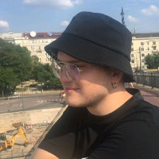

# Apex Corse

https://github.com/Formula-SAE/IT/blob/main/README.md

## Chi Siamo?

Apex Corse è la scuderia dell’Università di Palermo che nasce nel 2023 con lo scopo di progettare e produrre auto da 
corsa destinate a competere nel campionato internazionale della Formula SAE (Society of Automotive Engineers) contro le
migliori università di tutto il mondo.

# LA COMPETIZIONE

La Formula SAE, fondata nel 1981 dalla Society of Automotive Engineers, è una competizione internazionale che coinvolge 
le università e i loro studenti nella creazione di squadre finalizzate alla progettazione di piccole monoposto e la loro
valutazione a 360 gradi tramite sfide in pista e non.

## TEAM IT

Il team IT è il garante dell’infrastruttura informatica del team. Sviluppo del software di acquisizione dati, analisi 
dei dati e gestione del sistema informatico sono solo alcuni dei compiti che questo team svolge per supportare il lavoro
di tutti gli altri team.

|  |  |  |
|:--------------------------------------------------------------:|:---------------------------------------------------------------:|:--------------------------------------------------------------------------:|
| [Gabriele Amorello](https://www.linkedin.com/in/gabriele-salvatore-amorello-808954180/) Team Leader | [Simone Salvatore La Milia]() Cloud Developer | [Gabriele Lo Cascio](https://www.linkedin.com/in/gabriele-locascio/) Embedded Software & Telegram Developer |

|  |  |  |
|:-------------------------------------------------------------:|:-------------------------------------------------------:|:-------------------------------------------------------:|
| [Gabriele La Milia](https://www.linkedin.com/in/gabrielelm/) WordPress Developer | [Marcello Pardo]() Embedded Software Developer | [Giuseppe Alosi](https://www.linkedin.com/in/giuseppe-alosi-47a898202/) IT Technician |

|  |  |
|:-------------------------------------------------------------:|:----------------------------------------------:|
| [Giuseppe Scibetta](https://www.linkedin.com/in/giuseppeshib/) New Entry | [Francesco Abitabile]() New Entry |

