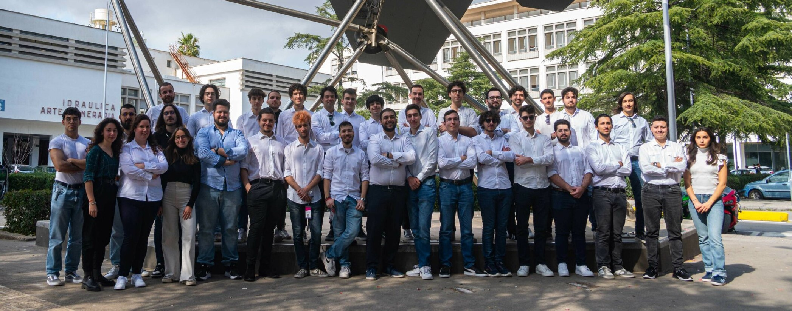

# Apex Corse

## Chi Siamo?

Apex Corse è la scuderia dell’Università di Palermo che nasce nel 2023 con lo scopo di progettare e produrre auto da 
corsa destinate a competere nel campionato internazionale della Formula SAE (Society of Automotive Engineers) contro le
migliori università di tutto il mondo.

# LA COMPETIZIONE

La Formula SAE, fondata nel 1981 dalla Society of Automotive Engineers, è una competizione internazionale che coinvolge 
le università e i loro studenti nella creazione di squadre finalizzate alla progettazione di piccole monoposto e la loro
valutazione a 360 gradi tramite sfide in pista e non.

## TEAM IT

Il team IT è il garante dell’infrastruttura informatica del team. Sviluppo del software di acquisizione dati, analisi 
dei dati e gestione del sistema informatico sono solo alcuni dei compiti che questo team svolge per supportare il lavoro
di tutti gli altri team.

[Gabriele Amorello](https://www.linkedin.com/in/gabriele-salvatore-amorello-808954180/) - Team Leader

[Gabriele Lo Cascio](https://www.linkedin.com/in/gabriele-locascio/) - Embedded Software & Telegram Developer

[Simone Salvatore La Milia]() - Cloud Developer

[Gabriele La Milia](https://www.linkedin.com/in/gabrielelm/) - WordPress Developer

[Giuseppe Alosi](https://www.linkedin.com/in/giuseppe-alosi-47a898202/) - IT Technician

[Marcello Pardo]() - Embedded Software Developer

[Sergio Imperiale](https://www.linkedin.com/in/sergio-imperiale-99b39022b/) - IT Support

